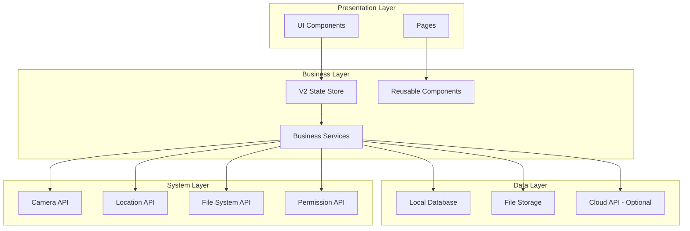
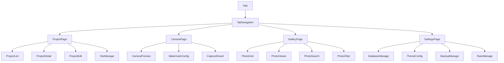
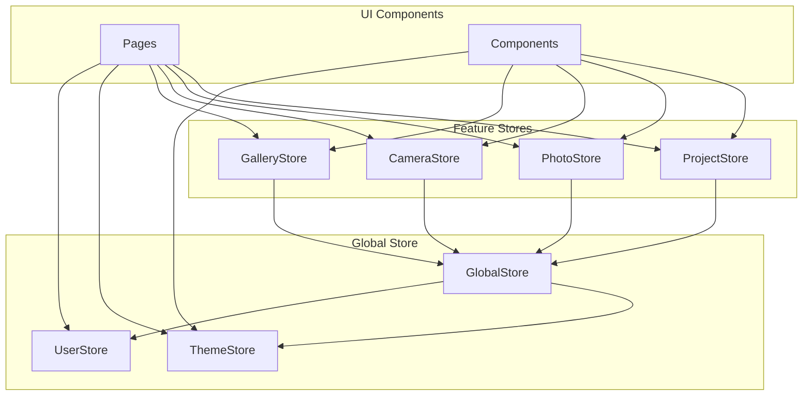
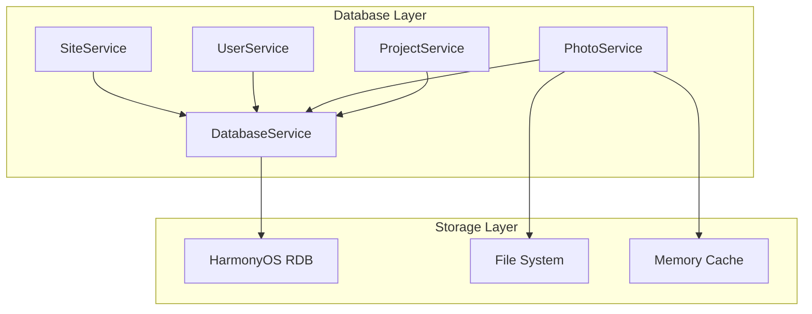

# EngineeringCamera 技术设计文档

> **版本**: v1.0.0
> **创建日期**: 2025-10-21
> **技术栈**: HarmonyOS NEXT + ArkTS + ArkUI + V2响应式

## 1. 系统架构设计

### 1.1 整体架构



### 1.2 技术选型说明

#### 核心技术栈
- **开发语言**: ArkTS (TypeScript超集)
- **UI框架**: ArkUI (声明式UI)
- **状态管理**: V2响应式 (@ObservedV2, @Trace, @Local, @Param)
- **本地存储**: HarmonyOS关系型数据库 (RDB)
- **图片处理**: Canvas API + 图像处理库
- **地图服务**: 系统地图API

#### 技术选择理由
1. **ArkTS + V2响应式**: 提供类型安全和细粒度响应式更新
2. **本地数据库优先**: 保证数据隐私和离线可用性
3. **模块化架构**: 支持功能扩展和维护
4. **组件化设计**: 提高代码复用性

## 2. 项目结构设计

### 2.1 目录结构

```
EngineeringCamera/
├── src/
│   ├── main/
│   │   ├── ets/                    # ArkTS源码目录
│   │   │   ├── entry/              # 应用入口
│   │   │   │   ├── EntryAbility.ets
│   │   │   │   └── EntryBackupAbility.ets
│   │   │   ├── pages/              # 页面组件
│   │   │   │   ├── project/        # 项目管理页面
│   │   │   │   │   ├── ProjectListPage.ets
│   │   │   │   │   ├── ProjectDetailPage.ets
│   │   │   │   │   └── ProjectEditPage.ets
│   │   │   │   ├── camera/         # 相机页面
│   │   │   │   │   ├── CameraPage.ets
│   │   │   │   │   ├── WatermarkConfigPage.ets
│   │   │   │   │   └── CameraPreviewPage.ets
│   │   │   │   ├── gallery/        # 相册页面
│   │   │   │   │   ├── GalleryPage.ets
│   │   │   │   │   ├── PhotoDetailPage.ets
│   │   │   │   │   └── PhotoSearchPage.ets
│   │   │   │   ├── editor/         # 编辑页面
│   │   │   │   │   ├── PhotoEditorPage.ets
│   │   │   │   │   ├── DoodleEditorPage.ets
│   │   │   │   │   └── AnnotationEditorPage.ets
│   │   │   │   ├── export/         # 导出页面
│   │   │   │   │   ├── ExportPage.ets
│   │   │   │   │   ├── ReportGenPage.ets
│   │   │   │   │   └── SharePage.ets
│   │   │   │   ├── team/           # 团队管理页面
│   │   │   │   │   ├── TeamPage.ets
│   │   │   │   │   ├── MemberManagePage.ets
│   │   │   │   │   └── PermissionPage.ets
│   │   │   │   ├── settings/       # 设置页面
│   │   │   │   │   ├── SettingsPage.ets
│   │   │   │   │   ├── DatabasePage.ets
│   │   │   │   │   ├── ThemePage.ets
│   │   │   │   │   └── BackupPage.ets
│   │   │   │   └── common/         # 通用页面
│   │   │   │       ├── SplashPage.ets
│   │   │   │       ├── GuidePage.ets
│   │   │   │       └── PermissionPage.ets
│   │   │   ├── components/         # 可复用组件
│   │   │   │   ├── watermark/      # 水印组件
│   │   │   │   │   ├── WatermarkPreview.ets
│   │   │   │   │   ├── WatermarkTemplate.ets
│   │   │   │   │   └── WatermarkEditor.ets
│   │   │   │   ├── photo/          # 照片组件
│   │   │   │   │   ├── PhotoGrid.ets
│   │   │   │   │   ├── PhotoItem.ets
│   │   │   │   │   └── PhotoViewer.ets
│   │   │   │   ├── editor/         # 编辑组件
│   │   │   │   │   ├── DoodleCanvas.ets
│   │   │   │   │   ├── TextAnnotation.ets
│   │   │   │   │   └── ShapeAnnotation.ets
│   │   │   │   ├── map/            # 地图组件
│   │   │   │   │   ├── LocationPicker.ets
│   │   │   │   │   └── MapPreview.ets
│   │   │   │   └── common/         # 通用组件
│   │   │   │       ├── LoadingDialog.ets
│   │   │   │       ├── ConfirmDialog.ets
│   │   │   │       ├── SearchBar.ets
│   │   │   │       └── EmptyView.ets
│   │   │   ├── store/              # V2状态管理
│   │   │   │   ├── index.ts        # Store入口
│   │   │   │   ├── project/        # 项目状态
│   │   │   │   │   ├── ProjectStore.ets
│   │   │   │   │   └── SiteStore.ets
│   │   │   │   ├── photo/          # 照片状态
│   │   │   │   │   ├── PhotoStore.ets
│   │   │   │   │   └── GalleryStore.ets
│   │   │   │   ├── user/           # 用户状态
│   │   │   │   │   ├── UserStore.ets
│   │   │   │   │   └── TeamStore.ets
│   │   │   │   ├── setting/        # 设置状态
│   │   │   │   │   ├── ThemeStore.ets
│   │   │   │   │   └── ConfigStore.ets
│   │   │   │   └── base/           # 基础状态
│   │   │   │       ├── BaseStore.ets
│   │   │   │       └── GlobalStore.ets
│   │   │   ├── services/           # 业务服务
│   │   │   │   ├── database/       # 数据库服务
│   │   │   │   │   ├── DatabaseService.ets
│   │   │   │   │   ├── ProjectService.ets
│   │   │   │   │   ├── PhotoService.ets
│   │   │   │   │   └── UserService.ets
│   │   │   │   ├── camera/         # 相机服务
│   │   │   │   │   ├── CameraService.ets
│   │   │   │   │   ├── PhotoCaptureService.ets
│   │   │   │   │   └── WatermarkService.ets
│   │   │   │   ├── location/       # 定位服务
│   │   │   │   │   ├── LocationService.ets
│   │   │   │   │   ├── GeoService.ets
│   │   │   │   │   └── WeatherService.ets
│   │   │   │   ├── storage/        # 存储服务
│   │   │   │   │   ├── FileService.ets
│   │   │   │   │   ├── CacheService.ets
│   │   │   │   │   └── BackupService.ets
│   │   │   │   ├── export/         # 导出服务
│   │   │   │   │   ├── ExportService.ets
│   │   │   │   │   ├── ReportService.ets
│   │   │   │   │   └── ShareService.ets
│   │   │   │   └── cloud/          # 云服务
│   │   │   │       ├── CloudService.ets
│   │   │   │       ├── SyncService.ets
│   │   │   │       └── AuthCloudService.ets
│   │   │   ├── models/             # 数据模型
│   │   │   │   ├── Project.ets     # 项目模型
│   │   │   │   ├── Site.ets        # 工点模型
│   │   │   │   ├── Photo.ets       # 照片模型
│   │   │   │   ├── User.ets        # 用户模型
│   │   │   │   ├── WatermarkTemplate.ets # 水印模板
│   │   │   │   └── base/           # 基础模型
│   │   │   │       ├── BaseModel.ets
│   │   │   │       └── TimestampModel.ets
│   │   │   ├── utils/              # 工具函数
│   │   │   │   ├── logger/         # 日志工具
│   │   │   │   ├── permission/     # 权限工具
│   │   │   │   ├── format/         # 格式化工具
│   │   │   │   ├── geo/            # 地理工具
│   │   │   │   ├── time/           # 时间工具
│   │   │   │   ├── image/          # 图片工具
│   │   │   │   └── common/         # 通用工具
│   │   │   ├── constants/          # 常量定义
│   │   │   │   ├── AppConstants.ets
│   │   │   │   ├── DatabaseConstants.ets
│   │   │   │   └── UIConstants.ets
│   │   │   └── types/              # 类型定义
│   │   │       ├── AppTypes.ets
│   │   │       ├── PhotoTypes.ets
│   │   │       └── ServiceTypes.ets
│   │   └── resources/              # 资源文件
│   │       ├── base/               # 基础资源
│   │       ├── element/            # 元素资源
│   │       └── media/              # 媒体资源
├── specs/                          # 规格文档
├── docs/                           # 文档目录
├── .ai-rules/                      # AI规则文件
├── build/                          # 构建输出
└── README.md
```

## 3. 数据模型设计

### 3.1 核心数据模型 (使用@ObservedV2装饰器)

#### 3.1.1 项目模型 (Project)
```typescript
@ObservedV2
export class Project extends BaseModel {
  @Trace id: string = ''                    // 项目ID
  @Trace name: string = ''                  // 项目名称
  @Trace code: string = ''                  // 项目编号
  @Trace client: string = ''                // 客户名称
  @Trace manager: string = ''               // 项目经理
  @Trace startDate: Date = new Date()       // 开始日期
  @Trace endDate: Date = new Date()         // 结束日期
  @Trace description: string = ''           // 项目描述
  @Trace tags: string[] = []                // 项目标签
  @Trace status: ProjectStatus = ProjectStatus.ACTIVE // 项目状态
  @Trace siteCount: number = 0              // 工点数量
  @Trace photoCount: number = 0             // 照片数量
  @Local metadata: Record<string, any> = {} // 扩展元数据

  // 关联数据 (通过查询获取)
  sites: Site[] = []
  photos: Photo[] = []
}

export enum ProjectStatus {
  ACTIVE = 'active',
  COMPLETED = 'completed',
  PAUSED = 'paused',
  CANCELLED = 'cancelled'
}
```

#### 3.1.2 工点模型 (Site)
```typescript
@ObservedV2
export class Site extends BaseModel {
  @Trace id: string = ''                    // 工点ID
  @Trace projectId: string = ''             // 所属项目ID
  @Trace name: string = ''                  // 工点名称
  @Trace address: string = ''               // 地址
  @Trace latitude: number = 0               // 纬度
  @Trace longitude: number = 0              // 经度
  @Trace altitude: number = 0               // 海拔
  @Trace description: string = ''           // 工点描述
  @Trace tags: string[] = []                // 工点标签
  @Trace photoCount: number = 0             // 照片数量
  @Local locationData: LocationData | null = null // 详细位置数据

  // 关联数据
  project: Project | null = null
  photos: Photo[] = []
}

export interface LocationData {
  country: string
  province: string
  city: string
  district: string
  street: string
  postalCode: string
}
```

#### 3.1.3 照片模型 (Photo)
```typescript
@ObservedV2
export class Photo extends BaseModel {
  @Trace id: string = ''                    // 照片ID
  @Trace projectId: string = ''             // 所属项目ID
  @Trace siteId: string = ''                // 所属工点ID
  @Trace filePath: string = ''              // 文件路径
  @Trace thumbnailPath: string = ''         // 缩略图路径
  @Trace takenAt: Date = new Date()         // 拍摄时间
  @Trace latitude: number = 0               // 拍摄纬度
  @Trace longitude: number = 0              // 拍摄经度
  @Trace altitude: number = 0               // 拍摄海拔
  @Trace azimuth: number = 0                // 方位角
  @Trace address: string = ''               // 地址
  @Trace weather: WeatherInfo | null = null // 天气信息
  @Trace templateId: string = ''            // 水印模板ID
  @Trace notes: string = ''                 // 备注
  @Trace tags: string[] = []                // 标签
  @Trace fileSize: number = 0               // 文件大小
  @Trace width: number = 0                  // 图片宽度
  @Trace height: number = 0                 // 图片高度
  @Trace edited: boolean = false            // 是否已编辑
  @Local exifData: Record<string, any> = {} // EXIF数据
  @Local annotations: Annotation[] = []     // 标注信息

  // 关联数据
  project: Project | null = null
  site: Site | null = null
  watermarkTemplate: WatermarkTemplate | null = null
}

export interface WeatherInfo {
  temperature: number
  humidity: number
  condition: string
  icon: string
}

export interface Annotation {
  id: string
  type: 'text' | 'shape' | 'doodle' | 'mosaic'
  content: any
  position: { x: number, y: number }
  style: Record<string, any>
  createdAt: Date
}
```

#### 3.1.4 水印模板模型 (WatermarkTemplate)
```typescript
@ObservedV2
export class WatermarkTemplate extends BaseModel {
  @Trace id: string = ''                    // 模板ID
  @Trace name: string = ''                  // 模板名称
  @Trace description: string = ''           // 模板描述
  @Trace category: TemplateCategory = TemplateCategory.CUSTOM // 模板分类
  @Trace fields: WatermarkField[] = []      // 显示字段
  @Trace style: WatermarkStyle = {}         // 样式配置
  @Trace preview: string = ''               // 预览图路径
  @Trace isDefault: boolean = false         // 是否默认
  @Trace isSystem: boolean = false          // 是否系统模板
  @Trace usageCount: number = 0             // 使用次数
  @Local config: Record<string, any> = {}   // 扩展配置
}

export enum TemplateCategory {
  SYSTEM = 'system',
  CONSTRUCTION = 'construction',
  QUALITY = 'quality',
  SAFETY = 'safety',
  CUSTOM = 'custom'
}

export interface WatermarkField {
  key: string
  label: string
  enabled: boolean
  format?: string
  position?: { x: number, y: number }
}

export interface WatermarkStyle {
  backgroundColor: string
  textColor: string
  fontSize: number
  fontFamily: string
  opacity: number
  borderRadius: number
  padding: number
  position: 'top-left' | 'top-right' | 'bottom-left' | 'bottom-right' | 'center'
}
```

### 3.2 数据库表结构设计

#### 3.2.1 项目表 (projects)
```sql
CREATE TABLE projects (
  project_id TEXT PRIMARY KEY,
  name TEXT NOT NULL,
  code TEXT,
  client TEXT,
  manager TEXT,
  start_date INTEGER,
  end_date INTEGER,
  description TEXT,
  tags TEXT, -- JSON数组
  status TEXT DEFAULT 'active',
  created_at INTEGER NOT NULL,
  updated_at INTEGER NOT NULL,
  metadata TEXT -- JSON对象
);

CREATE INDEX idx_projects_name ON projects(name);
CREATE INDEX idx_projects_status ON projects(status);
CREATE INDEX idx_projects_dates ON projects(start_date, end_date);
```

#### 3.2.2 工点表 (sites)
```sql
CREATE TABLE sites (
  site_id TEXT PRIMARY KEY,
  project_id TEXT NOT NULL,
  name TEXT NOT NULL,
  address TEXT,
  latitude REAL,
  longitude REAL,
  altitude REAL,
  description TEXT,
  tags TEXT, -- JSON数组
  location_data TEXT, -- JSON对象
  created_at INTEGER NOT NULL,
  updated_at INTEGER NOT NULL,
  FOREIGN KEY (project_id) REFERENCES projects(project_id) ON DELETE CASCADE
);

CREATE INDEX idx_sites_project_id ON sites(project_id);
CREATE INDEX idx_sites_location ON sites(latitude, longitude);
CREATE INDEX idx_sites_name ON sites(name);
```

#### 3.2.3 照片表 (photos)
```sql
CREATE TABLE photos (
  photo_id TEXT PRIMARY KEY,
  project_id TEXT NOT NULL,
  site_id TEXT NOT NULL,
  file_path TEXT NOT NULL,
  thumbnail_path TEXT,
  taken_at INTEGER NOT NULL,
  latitude REAL,
  longitude REAL,
  altitude REAL,
  azimuth REAL,
  address TEXT,
  weather TEXT, -- JSON对象
  template_id TEXT,
  notes TEXT,
  tags TEXT, -- JSON数组
  file_size INTEGER,
  width INTEGER,
  height INTEGER,
  edited INTEGER DEFAULT 0,
  exif_data TEXT, -- JSON对象
  annotations TEXT, -- JSON数组
  created_at INTEGER NOT NULL,
  updated_at INTEGER NOT NULL,
  FOREIGN KEY (project_id) REFERENCES projects(project_id) ON DELETE CASCADE,
  FOREIGN KEY (site_id) REFERENCES sites(site_id) ON DELETE CASCADE
);

CREATE INDEX idx_photos_project_id ON photos(project_id);
CREATE INDEX idx_photos_site_id ON photos(site_id);
CREATE INDEX idx_photos_taken_at ON photos(taken_at);
CREATE INDEX idx_photos_location ON photos(latitude, longitude);
CREATE INDEX idx_photos_tags ON photos(tags);
```

## 4. 组件架构设计

### 4.1 页面组件层次结构



### 4.2 核心组件设计

#### 4.2.1 项目列表组件 (ProjectList)
```typescript
@Component
export struct ProjectList {
  @Param projectStore: ProjectStore
  @State searchQuery: string = ''
  @State selectedFilter: string = 'all'
  @State isLoading: boolean = false

  build() {
    Column() {
      // 搜索栏
      SearchBar({
        query: this.searchQuery,
        onSearch: (query: string) => {
          this.searchQuery = query
          this.projectStore.searchProjects(query)
        }
      })

      // 筛选器
      FilterBar({
        selectedFilter: this.selectedFilter,
        onFilterChange: (filter: string) => {
          this.selectedFilter = filter
          this.projectStore.filterProjects(filter)
        }
      })

      // 项目列表
      if (this.isLoading) {
        LoadingView()
      } else {
        List() {
          ForEach(
            this.projectStore.filteredProjects,
            (project: Project) => {
              ListItem() {
                ProjectCard({ project: project })
              }
              .onClick(() => {
                router.pushUrl({
                  url: 'pages/project/ProjectDetailPage',
                  params: { projectId: project.id }
                })
              })
            },
            (project: Project) => project.id
          )
        }
      }

      // 浮动添加按钮
      FloatingActionButton({
        icon: $r('app.media.ic_add'),
        onClick: () => {
          router.pushUrl({ url: 'pages/project/ProjectEditPage' })
        }
      })
    }
  }
}
```

#### 4.2.2 相机预览组件 (CameraPreview)
```typescript
@Component
export struct CameraPreview {
  @State cameraController: camera.CameraController | null = null
  @State isCapturing: boolean = false
  @Param watermarkConfig: WatermarkConfig
  @Param onCapture: (image: PixelMap) => void

  aboutToAppear() {
    this.initializeCamera()
  }

  aboutToDisappear() {
    this.releaseCamera()
  }

  build() {
    Stack() {
      // 相机预览
      XComponent({
        id: 'camera-preview',
        type: 'surface',
        libraryname: 'camera'
      })
      .onLoad(() => {
        this.setupCamera()
      })

      // 水印覆盖层
      WatermarkOverlay({
        config: this.watermarkConfig,
        location: this.currentLocation,
        time: new Date()
      })

      // 控制按钮
      Row() {
        // 相册按钮
        IconButton({
          icon: $r('app.media.ic_gallery'),
          onClick: () => this.openGallery()
        })

        Blank()

        // 拍照按钮
        Button({
          type: ButtonType.Circle,
          onClick: () => this.capturePhoto()
        }) {
          Image($r('app.media.ic_camera'))
        }
        .enabled(!this.isCapturing)

        Blank()

        // 设置按钮
        IconButton({
          icon: $r('app.media.ic_settings'),
          onClick: () => this.openWatermarkSettings()
        })
      }
      .justifyContent(FlexAlign.SpaceAround)
      .position({ x: 0, y: '85%' })
      .width('100%')
    }
  }

  private async capturePhoto() {
    if (!this.cameraController || this.isCapturing) return

    this.isCapturing = true
    try {
      const photoInfo = await this.cameraController.takePhoto()
      const processedImage = await this.applyWatermark(photoInfo)
      this.onCapture(processedImage)
    } catch (error) {
      logger.error('拍照失败', error)
    } finally {
      this.isCapturing = false
    }
  }
}
```

## 5. 状态管理设计

### 5.1 V2响应式状态管理架构



### 5.2 核心Store设计

#### 5.2.1 项目状态管理 (ProjectStore)
```typescript
@ObservedV2
export class ProjectStore extends BaseStore {
  @Trace projects: Project[] = []
  @Trace currentProject: Project | null = null
  @Trace filteredProjects: Project[] = []
  @Trace isLoading: boolean = false
  @Trace error: string = ''
  @Trace searchQuery: string = ''
  @Trace selectedFilter: ProjectFilter = ProjectFilter.ALL
  @Trace sortOrder: ProjectSortOrder = ProjectSortOrder.CREATED_DESC

  constructor(private projectService: ProjectService) {
    super()
    this.loadProjects()
  }

  async loadProjects() {
    this.isLoading = true
    try {
      this.projects = await this.projectService.getAllProjects()
      this.applyFilters()
    } catch (error) {
      this.error = '加载项目失败'
      logger.error('ProjectStore.loadProjects', error)
    } finally {
      this.isLoading = false
    }
  }

  async createProject(projectData: Partial<Project>) {
    try {
      const project = await this.projectService.createProject(projectData)
      this.projects.unshift(project)
      this.applyFilters()
      return project
    } catch (error) {
      this.error = '创建项目失败'
      throw error
    }
  }

  async updateProject(projectId: string, updates: Partial<Project>) {
    try {
      const updatedProject = await this.projectService.updateProject(projectId, updates)
      const index = this.projects.findIndex(p => p.id === projectId)
      if (index !== -1) {
        this.projects[index] = updatedProject
        this.applyFilters()
      }
      if (this.currentProject?.id === projectId) {
        this.currentProject = updatedProject
      }
      return updatedProject
    } catch (error) {
      this.error = '更新项目失败'
      throw error
    }
  }

  async deleteProject(projectId: string) {
    try {
      await this.projectService.deleteProject(projectId)
      this.projects = this.projects.filter(p => p.id !== projectId)
      this.applyFilters()
      if (this.currentProject?.id === projectId) {
        this.currentProject = null
      }
    } catch (error) {
      this.error = '删除项目失败'
      throw error
    }
  }

  setCurrentProject(project: Project | null) {
    this.currentProject = project
  }

  searchProjects(query: string) {
    this.searchQuery = query
    this.applyFilters()
  }

  filterProjects(filter: ProjectFilter) {
    this.selectedFilter = filter
    this.applyFilters()
  }

  sortProjects(order: ProjectSortOrder) {
    this.sortOrder = order
    this.applyFilters()
  }

  @Monitor('projects', 'searchQuery', 'selectedFilter', 'sortOrder')
  private applyFilters() {
    let filtered = [...this.projects]

    // 应用搜索过滤
    if (this.searchQuery) {
      const query = this.searchQuery.toLowerCase()
      filtered = filtered.filter(project =>
        project.name.toLowerCase().includes(query) ||
        project.code.toLowerCase().includes(query) ||
        project.client.toLowerCase().includes(query) ||
        project.description.toLowerCase().includes(query)
      )
    }

    // 应用状态过滤
    if (this.selectedFilter !== ProjectFilter.ALL) {
      filtered = filtered.filter(project => project.status === this.selectedFilter)
    }

    // 应用排序
    switch (this.sortOrder) {
      case ProjectSortOrder.NAME_ASC:
        filtered.sort((a, b) => a.name.localeCompare(b.name))
        break
      case ProjectSortOrder.NAME_DESC:
        filtered.sort((a, b) => b.name.localeCompare(a.name))
        break
      case ProjectSortOrder.CREATED_ASC:
        filtered.sort((a, b) => a.createdAt.getTime() - b.createdAt.getTime())
        break
      case ProjectSortOrder.CREATED_DESC:
      default:
        filtered.sort((a, b) => b.createdAt.getTime() - a.createdAt.getTime())
        break
    }

    this.filteredProjects = filtered
  }
}

export enum ProjectFilter {
  ALL = 'all',
  ACTIVE = 'active',
  COMPLETED = 'completed',
  PAUSED = 'paused'
}

export enum ProjectSortOrder {
  NAME_ASC = 'name_asc',
  NAME_DESC = 'name_desc',
  CREATED_ASC = 'created_asc',
  CREATED_DESC = 'created_desc'
}
```

#### 5.2.2 主题状态管理 (ThemeStore)
```typescript
@ObservedV2
export class ThemeStore extends BaseStore {
  @StorageLink('theme.mode') mode: ThemeMode = ThemeMode.SYSTEM
  @Trace currentTheme: Theme = themes.light
  @Trace isDark: boolean = false

  constructor() {
    super()
    this.initializeTheme()
    this.setupSystemThemeListener()
  }

  private initializeTheme() {
    this.updateTheme()
  }

  private setupSystemThemeListener() {
    try {
      // 监听系统主题变化
      configuration.on('change', (configuration) => {
        if (this.mode === ThemeMode.SYSTEM) {
          this.updateTheme()
        }
      })
    } catch (error) {
      logger.error('设置系统主题监听失败', error)
    }
  }

  @Monitor('mode')
  private updateTheme() {
    let systemDark = false

    if (this.mode === ThemeMode.SYSTEM) {
      try {
        systemDark = configuration.colorMode === configuration.ColorMode.DARK
      } catch (error) {
        logger.error('获取系统主题失败', error)
        systemDark = false
      }
    }

    const shouldBeDark = this.mode === ThemeMode.DARK ||
                         (this.mode === ThemeMode.SYSTEM && systemDark)

    this.isDark = shouldBeDark
    this.currentTheme = shouldBeDark ? themes.dark : themes.light
  }

  setThemeMode(mode: ThemeMode) {
    this.mode = mode
  }

  getThemeColors(): ThemeColors {
    return this.currentTheme.colors
  }

  getThemeTypography(): ThemeTypography {
    return this.currentTheme.typography
  }

  getThemeSpacing(): ThemeSpacing {
    return this.currentTheme.spacing
  }
}

export enum ThemeMode {
  LIGHT = 'light',
  DARK = 'dark',
  SYSTEM = 'system'
}

export interface Theme {
  colors: ThemeColors
  typography: ThemeTypography
  spacing: ThemeSpacing
}

export interface ThemeColors {
  primary: string
  secondary: string
  background: string
  surface: string
  error: string
  onPrimary: string
  onSecondary: string
  onBackground: string
  onSurface: string
  onError: string
  text: {
    primary: string
    secondary: string
    disabled: string
  }
  border: {
    default: string
    focus: string
    error: string
  }
}

export const themes = {
  light: {
    colors: {
      primary: '#1976D2',
      secondary: '#424242',
      background: '#FFFFFF',
      surface: '#F5F5F5',
      error: '#D32F2F',
      onPrimary: '#FFFFFF',
      onSecondary: '#FFFFFF',
      onBackground: '#000000',
      onSurface: '#000000',
      onError: '#FFFFFF',
      text: {
        primary: '#212121',
        secondary: '#757575',
        disabled: '#BDBDBD'
      },
      border: {
        default: '#E0E0E0',
        focus: '#1976D2',
        error: '#D32F2F'
      }
    }
  },
  dark: {
    colors: {
      primary: '#90CAF9',
      secondary: '#616161',
      background: '#121212',
      surface: '#1E1E1E',
      error: '#CF6679',
      onPrimary: '#000000',
      onSecondary: '#000000',
      onBackground: '#FFFFFF',
      onSurface: '#FFFFFF',
      onError: '#000000',
      text: {
        primary: '#FFFFFF',
        secondary: '#B3B3B3',
        disabled: '#666666'
      },
      border: {
        default: '#333333',
        focus: '#90CAF9',
        error: '#CF6679'
      }
    }
  }
}
```

## 6. 服务层设计

### 6.1 数据库服务架构



### 6.2 核心服务实现

#### 6.2.1 数据库基础服务 (DatabaseService)
```typescript
export class DatabaseService {
  private db: relationalStore.RdbStore | null = null
  private dbVersion: number = 1
  private dbName: string = 'engineering_camera.db'

  async initialize(): Promise<void> {
    try {
      const config = {
        name: this.dbName,
        securityLevel: relationalStore.SecurityLevel.S1
      }

      this.db = await relationalStore.getRdbStore(getContext(), config)
      await this.createTables()
      await this.createIndexes()
    } catch (error) {
      logger.error('数据库初始化失败', error)
      throw new DatabaseError('数据库初始化失败', error)
    }
  }

  private async createTables(): Promise<void> {
    const tables = [
      this.createProjectsTable(),
      this.createSitesTable(),
      this.createPhotosTable(),
      this.createWatermarkTemplatesTable(),
      this.createUsersTable(),
      this.createBackupsTable()
    ]

    for (const tableSql of tables) {
      await this.db!.executeSql(tableSql)
    }
  }

  private createProjectsTable(): string {
    return `
      CREATE TABLE IF NOT EXISTS projects (
        project_id TEXT PRIMARY KEY,
        name TEXT NOT NULL,
        code TEXT,
        client TEXT,
        manager TEXT,
        start_date INTEGER,
        end_date INTEGER,
        description TEXT,
        tags TEXT,
        status TEXT DEFAULT 'active',
        created_at INTEGER NOT NULL,
        updated_at INTEGER NOT NULL,
        metadata TEXT
      )
    `
  }

  private async createIndexes(): Promise<void> {
    const indexes = [
      'CREATE INDEX IF NOT EXISTS idx_projects_name ON projects(name)',
      'CREATE INDEX IF NOT EXISTS idx_projects_status ON projects(status)',
      'CREATE INDEX IF NOT EXISTS idx_projects_dates ON projects(start_date, end_date)',
      'CREATE INDEX IF NOT EXISTS idx_sites_project_id ON sites(project_id)',
      'CREATE INDEX IF NOT EXISTS idx_sites_location ON sites(latitude, longitude)',
      'CREATE INDEX IF NOT EXISTS idx_photos_project_id ON photos(project_id)',
      'CREATE INDEX IF NOT EXISTS idx_photos_site_id ON photos(site_id)',
      'CREATE INDEX IF NOT EXISTS idx_photos_taken_at ON photos(taken_at)'
    ]

    for (const indexSql of indexes) {
      await this.db!.executeSql(indexSql)
    }
  }

  async executeQuery<T>(sql: string, args: any[] = []): Promise<T[]> {
    try {
      const result = await this.db!.querySql(sql, args)
      return this.resultSetToArray<T>(result)
    } catch (error) {
      logger.error('查询执行失败', { sql, args, error })
      throw new DatabaseError('查询执行失败', error)
    }
  }

  async executeUpdate(sql: string, args: any[] = []): Promise<number> {
    try {
      return await this.db!.executeSql(sql, args)
    } catch (error) {
      logger.error('更新执行失败', { sql, args, error })
      throw new DatabaseError('更新执行失败', error)
    }
  }

  async beginTransaction(): Promise<void> {
    await this.db!.executeSql('BEGIN TRANSACTION')
  }

  async commitTransaction(): Promise<void> {
    await this.db!.executeSql('COMMIT')
  }

  async rollbackTransaction(): Promise<void> {
    await this.db!.executeSql('ROLLBACK')
  }

  private resultSetToArray<T>(resultSet: relationalStore.ResultSet): T[] {
    const results: T[] = []
    while (resultSet.goToNextRow()) {
      const item: any = {}
      const columnCount = resultSet.columnCount
      for (let i = 0; i < columnCount; i++) {
        const columnName = resultSet.getColumnName(i)
        const value = resultSet.getString(i)
        item[columnName] = this.parseValue(value)
      }
      results.push(item)
    }
    resultSet.close()
    return results
  }

  private parseValue(value: string): any {
    if (!value) return null

    // 尝试解析为数字
    if (/^-?\d+$/.test(value)) {
      return parseInt(value, 10)
    }
    if (/^-?\d*\.\d+$/.test(value)) {
      return parseFloat(value)
    }

    // 尝试解析为JSON
    if (value.startsWith('{') || value.startsWith('[')) {
      try {
        return JSON.parse(value)
      } catch {
        return value
      }
    }

    return value
  }

  async close(): Promise<void> {
    if (this.db) {
      await this.db.close()
      this.db = null
    }
  }
}
```

## 7. 安全设计

### 7.1 数据安全策略

#### 7.1.1 本地数据加密
- 敏感数据使用AES-256加密存储
- 数据库文件加密保护
- 照片文件可选加密存储

#### 7.1.2 权限管理
- 遵循最小权限原则
- 动态权限申请
- 权限使用说明和确认

#### 7.1.3 数据隐私保护
- 设备标识符脱敏
- 定位信息模糊化选项
- 用户数据删除机制

### 7.2 网络安全设计

#### 7.2.1 云端通信安全
- HTTPS/TLS加密传输
- API密钥管理
- 请求签名验证

#### 7.2.2 身份认证
- JWT令牌认证
- 刷新令牌机制
- 会话管理

## 8. 性能优化设计

### 8.1 数据库优化

#### 8.1.1 索引策略
- 为常用查询字段建立索引
- 复合索引优化
- 索引维护策略

#### 8.1.2 查询优化
- 分页查询
- 延迟加载
- 缓存策略

### 8.2 图片处理优化

#### 8.2.1 缩略图生成
- 多级缩略图
- 异步生成
- 缓存管理

#### 8.2.2 内存管理
- 图片压缩
- 内存缓存
- LRU淘汰策略

### 8.3 UI性能优化

#### 8.3.1 列表优化
- 虚拟滚动
- 懒加载
- 预加载策略

#### 8.3.2 动画优化
- 硬件加速
- 动画帧率控制
- 过渡效果优化

## 9. 测试策略

### 9.1 单元测试
- Store层测试
- Service层测试
- 工具函数测试

### 9.2 集成测试
- 数据库操作测试
- 文件操作测试
- API集成测试

### 9.3 UI测试
- 页面渲染测试
- 交互测试
- 兼容性测试

### 9.4 性能测试
- 内存使用测试
- 启动时间测试
- 操作响应时间测试

## 10. 部署与发布

### 10.1 构建配置
- 多环境配置
- 代码混淆
- 资源优化

### 10.2 版本管理
- 语义化版本
- 自动化发布
- 回滚机制

### 10.3 监控与分析
- 错误日志收集
- 性能监控
- 用户行为分析

---

**文档状态**: 待评审
**下一步**: 开发任务清单 (tasks.md)
**负责人**: strategic-planner